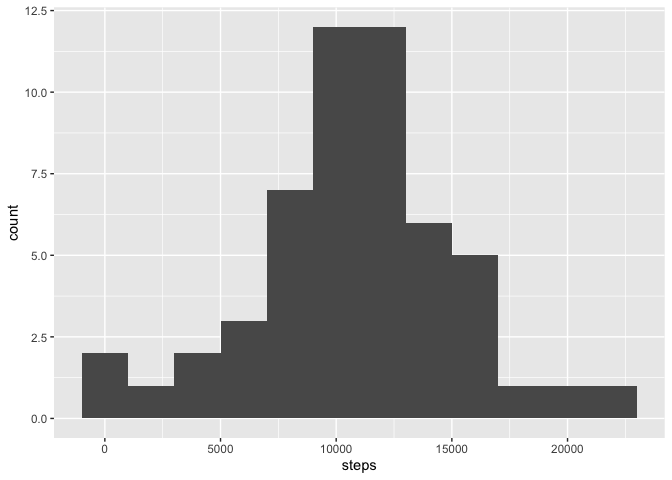
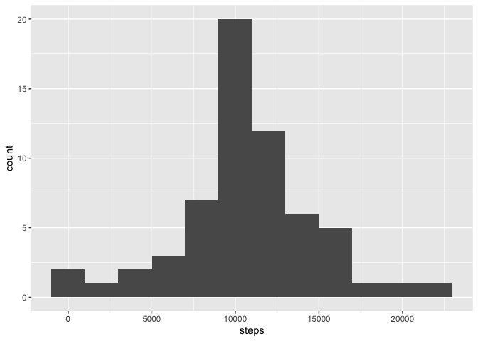

## Loading the data

First the activity data is loaded. Data contains the date and daily steps in 5 minute slots.


```r
library(dplyr)
library(ggplot2)
library(hms)

data <- read.csv('activity.csv')
```

# Daily steps

Then the total daily steps is calculated by day.


```r
steps <- data %>%
  filter(!is.na(steps)) %>%
  group_by(date) %>%
  summarise(steps=sum(steps, na.rm=T))
```

A histogram of the summary data.


```r
ggplot(steps, aes(x=steps)) +
  geom_histogram(binwidth=2000)
```

<!-- -->

The mean steps by day.


```r
mean(steps$steps)
```

```
## [1] 10766.19
```

And the corresponding median of the daily steps.


```r
median(steps$steps)
```

```
## [1] 10765
```

# Daily activity pattern

Next we calculate the average steps for each time slot.


```r
steps_by_interval <- data %>%
  group_by(interval) %>%
  summarise(steps=mean(steps, na.rm=T))
```

And we plot the avverage steps taken by time.


```r
ggplot(steps_by_interval %>% mutate(interval=hms(hours=as.integer(interval / 100), minutes=interval %% 100)),
       aes(x=interval, y=steps)) +
  geom_line() +
  scale_x_time(breaks=sapply(c(0,6, 12, 18, 24), function (hour) { hms(hour=hour) }))
```

<!-- -->

The 5 minute interval with maximum steps can be obtained.


```r
steps_by_interval[which.max(steps_by_interval$steps),]
```

```
## # A tibble: 1 x 2
##   interval steps
##      <int> <dbl>
## 1      835  206.
```

The results identifies 08:35 as the most active 5 minute interval on average with about 206 steps taken.

# Imputing missing values

There are some missing values in the dataset. The total amount of rows with missing step count can be obtained.


```r
data %>%
  filter(is.na(steps)) %>%
  summarise(count=n())
```

```
##   count
## 1  2304
```

We will next fill in the missing values with daily averages from corresponding interval for the missing step counts.


```r
imputed <- data

for (i in 1:nrow(imputed)) {
  if (is.na(imputed[i,'steps'])) {
    imputed[i,'steps'] <- first(steps_by_interval[steps_by_interval$interval==imputed[i,'interval'],]$steps)
  }
}
```

Then we revise the daily steps with imputed data.


```r
steps_imputed <- imputed %>%
  filter(!is.na(steps)) %>%
  group_by(date) %>%
  summarise(steps=sum(steps, na.rm=T))
```

And draw a corresponding histogram.


```r
ggplot(steps_imputed, aes(x=steps)) +
  geom_histogram(binwidth=2000)
```

<!-- -->

And have a look at the average and median values.

The mean steps by day.


```r
mean(steps_imputed$steps)
```

```
## [1] 10766.19
```

And the corresponding median of the daily steps.


```r
median(steps_imputed$steps)
```

```
## [1] 10766.19
```

As we can see, the missing data doesn't have a big meaning. The average stays exactly same and median changes only a little.

## Weekly patterns

Next we map dates to either weekdays or weekend days to spot differencies in behavior.


```r
day_data <- imputed %>%
  mutate(day=weekdays(as.Date(date))) %>%
  mutate(wd=recode_factor(day, 'Monday'='Weekday','Tuesday'='Weekday','Wednesday'='Weekday','Thursday'='Weekday',
                          'Friday'='Weekday','Saturday'='Weekend','Sunday'='Weekend')) %>%
  group_by(wd, interval) %>%
  summarise(steps=mean(steps))
```

The we plot the amounts by day type.


```r
ggplot(day_data, aes(x=interval, y=steps)) +
  geom_line() +
  facet_grid(wd ~ .)
```

<!-- -->
